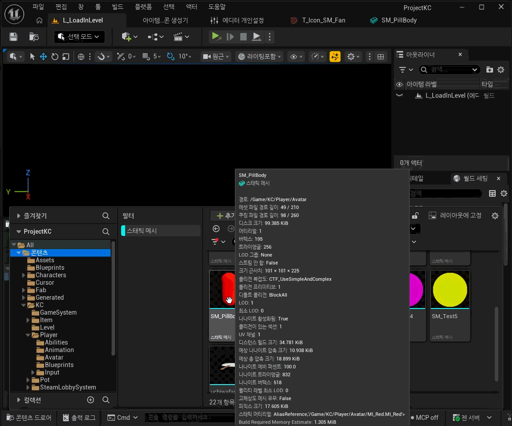
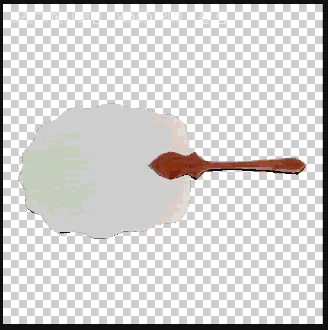

# Unreal Engine 아이템 아이콘 생성기




스태틱 메시를 촬영해 UI용 `Texture2D` 아이콘으로 저장하는 Unreal Engine 에디터 전용 플러그인입니다. 반복적인 카메라·조명 설정과 에셋 저장 작업을 하나의 에디터 패널에서 처리할 수 있도록 만들었습니다.

## 해결하려던 문제

아이템 메시마다 캡처 환경을 만들고, 구도와 조명을 맞추고, 이미지를 저장하는 작업은 수량이 늘어날수록 반복 비용이 커집니다. 이 플러그인은 여러 스태틱 메시를 목록에 추가한 뒤 같은 설정으로 순차 생성하고, 예외가 필요한 메시만 개별 구도를 조정할 수 있게 합니다.

## 주요 기능

- 선택한 스태틱 메시의 아이콘 일괄 생성
- 메시 선택과 설정 변경에 따른 자동 미리보기
- 세션 동안 유지되는 미리보기 캐시
- 마우스 드래그 메시 회전
- `W`/`A`/`S`/`D` 화면 구도 이동
- 마우스 휠 줌
- 키·필·백 3점 조명과 스카이·노출·채도 설정
- 조명색과 배경색 설정
- 투명 배경을 포함한 `Texture2D` 에셋 저장
- 프리뷰 씬, 메시 컴포넌트, 렌더 타깃 재사용
- 캐시된 미리보기 픽셀을 그대로 저장해 불필요한 재캡처 방지

## 새 프로젝트에서 머티리얼이 회색으로 보이던 문제

새 프로젝트에서는 머티리얼이나 셰이더 컴파일이 끝나기 전에 캡처가 실행되면 임시 fallback 머티리얼이 촬영되어 메시가 회색으로 보일 수 있습니다.

현재 버전은 캡처 전에 대기 중인 에셋과 셰이더 컴파일이 끝날 때까지 기다립니다. 첫 미리보기가 여전히 완전하지 않다면 컴파일 완료 후 **새로고침**을 누르고, 메시의 머티리얼 슬롯과 머티리얼 컴파일 오류도 확인하세요.

## 설치

### Release 패키지 사용

1. Unreal Editor를 종료합니다.
2. [v0.4.1 Release](https://github.com/wns96096-ui/UE-Item-Icon-Generator/releases/tag/v0.4.1)에서 UE 5.8용 ZIP을 내려받아 압축을 풉니다.
3. `ItemIconGenerator` 폴더를 `<프로젝트>/Plugins/` 아래에 복사합니다.
4. 프로젝트를 열고 안내가 나오면 플러그인 또는 모듈 로드를 승인합니다.
5. 상단 메뉴에서 **도구 > 아이템 아이콘 생성기**를 엽니다.

### 소스에서 설치

1. 이 저장소를 `<프로젝트>/Plugins/ItemIconGenerator`에 clone합니다.
2. IDE 작업 방식에 따라 프로젝트 파일을 다시 생성합니다.
3. 프로젝트의 Editor 타깃을 빌드한 뒤 Unreal Editor를 실행합니다.

## 사용 방법

1. 콘텐츠 브라우저에서 아이콘으로 만들 스태틱 메시를 하나 이상 선택합니다.
2. **도구 > 아이템 아이콘 생성기**를 열고 **콘텐츠 브라우저 선택 추가**를 누릅니다.
3. 출력 폴더, 이름 규칙, 해상도, 투명 배경 여부를 설정합니다.
4. 목록에서 메시를 선택하고 미리보기 구도를 조정합니다.
5. 한 개만 저장하려면 **선택 미리보기 저장**, 목록 전체를 처리하려면 **전체 생성**을 누릅니다.

기본 출력 폴더는 `/Game/Generated/ItemIcons`, 기본 이름 규칙은 `T_Icon_{MeshName}`입니다.

## 프로젝트 구조

```text
Config/                 플러그인 설정
Content/                플러그인 콘텐츠
Docs/                   문서와 미디어
Resources/              플러그인 리소스
Source/                 Editor 모듈 소스
ItemIconGenerator.uplugin
README.md               한국어 프로젝트 소개
README_KO.md            한국어 상세 사용설명서
QUICK_START_KO.md       팀원용 빠른 사용법
CHANGELOG.md
LICENSE
```

## 지원 엔진

- Unreal Engine 5.8
- Windows
- Editor-only 모듈

Editor-only 모듈이므로 패키징된 게임 실행 파일에는 포함되지 않습니다.

## 빌드

Unreal Engine의 `RunUAT BuildPlugin` 명령에 `ItemIconGenerator.uplugin`을 전달해 빌드할 수 있습니다. 패키지 출력 폴더는 저장소 밖에 두고, 배포 ZIP에서는 `Intermediate`와 PDB 파일을 제외하세요.

## 추가 문서

- [상세 사용설명서](README_KO.md)
- [팀원용 빠른 사용법](QUICK_START_KO.md)
- [변경 내역](CHANGELOG.md)

## 라이선스

[MIT License](LICENSE)로 배포합니다.

## 추후 추가할 이미지

- 도구 메뉴 위치
- 플러그인 전체 화면과 생성 목록
- 출력 설정 영역
- 미리보기 조작 안내
- 조명 설정과 변경 전후 비교
- 배치 생성 진행률
- 콘텐츠 브라우저에 저장된 `Texture2D` 결과
